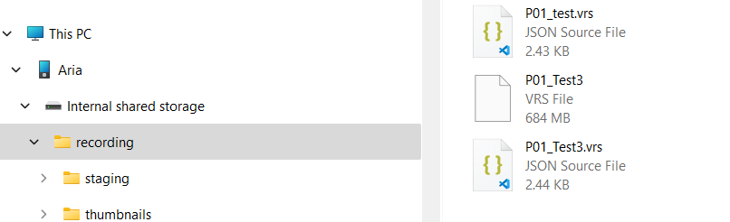
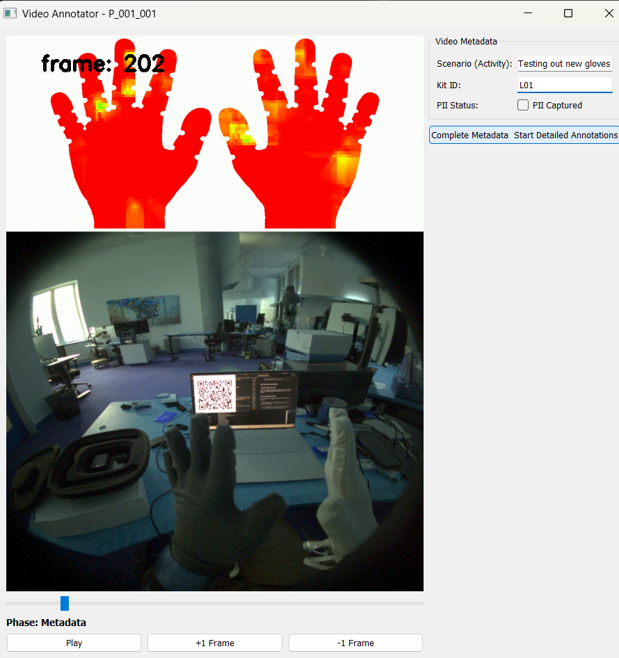
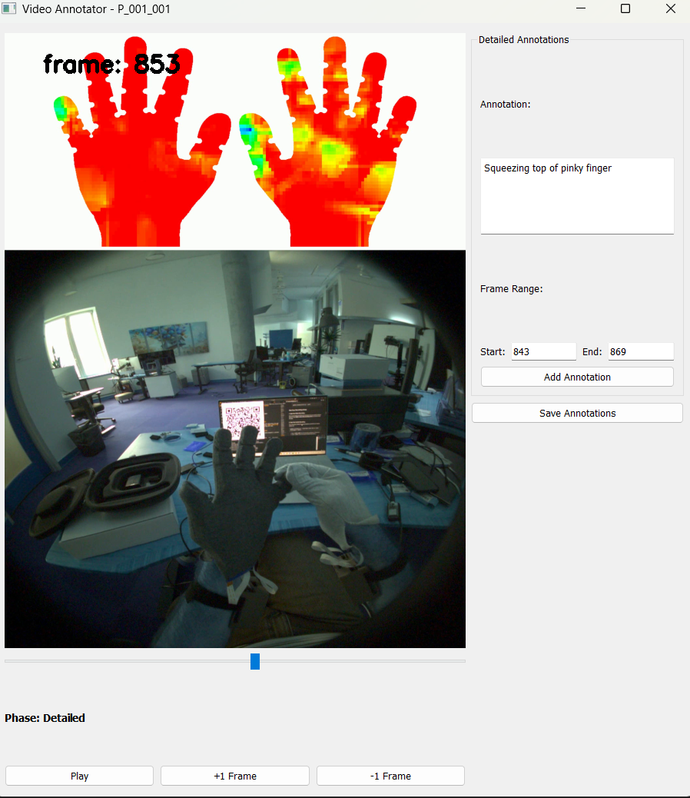
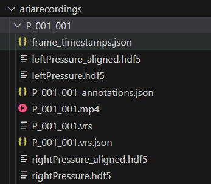

# Ego-Tactile Data Collection Protocol

This repo serves as detailed documentation of the data collection protocol to be followed for contribution to our joint tactile + egocentric vision dataset.

Our goal is to collect paired first person-video and bimanual tactile manipulation data as a combination of recreated [ego4d hand-object interactions](https://ego4d-data.org/docs/benchmarks/hands-and-objects/) and new "in-the-wild" tasks. 

## Infrastructure Setup

To contribute to this dataset, you will need access to both specific hardware and software components.

---

### Software

> \[TODO] Upload and link the Quest recording app here.

There are two main software components required:

1. **Egocentric Vision Backend**: Either [Project Aria](https://docs.google.com/document/d/1t-niAXtyPILsD9TdD60u0-aeOIRVg9gkqVwzWFDmDiM/edit?usp=sharing) or a custom [Oculus/Quest](https://www.meta.com/quest/quest-3s) backend, depending on which headset you’re using.
2. **This Repository**: Provides Python tools for recording tactile data, synchronizing and cleaning headset and tactile recordings, and annotating them.

To get started, follow the setup instructions for your specific headset and then clone this repository.

#### Setup for This Repository

1. Clone this repo:

   ```bash
   git clone https://github.com/devinmur29/aria_tactile_data_collection.git
   cd aria_tactile_data_collection
   ```
2. Create and activate a Python virtual environment using either `venv` or Anaconda. This code has been tested with Python 3.11.
3. Install required dependencies:

   ```bash
   pip install -r requirements.txt
   ```

---

### Hardware

You will need the following hardware:

* Two [tactile sensing gloves](https://github.com/devinmur29/fpcb-glove-design)
* Two ESP32 microcontrollers (as receivers)
* One headset: either a [Meta Quest 3S](https://www.meta.com/quest/quest-3s) or [Project Aria Glasses](https://facebookresearch.github.io/projectaria_tools/docs/intro)
* One laptop to run data collection scripts


---

### Glove Setup

1. Plug the **receiver ESP32 microcontrollers** into two available USB ports on your laptop.
2. Power the **transmitter microcontrollers** by removing the lid on the circuit housing, connecting their batteries, and closing the lid. If the lid is unsecure, add masking tape/electrical tape around the top to keep it on. 


3. Run one of the following based on your glove configuration:

   ```bash
   python autoDetectPort.py
   ```

   or, for small gloves:

   ```bash
   python autoDetectPort.py --small
   ```

---

## Test Your Recording Setup

### 1. Start the Video Recording

Put on your headset and follow the instructions for your specific hardware (Quest or Aria). **Make a note of the recording name** you specify during this step.

---

### 2. Start the Tactile Recording

Put on the gloves. While the camera (headset) is pointed at your laptop screen, run:

```bash
python recordOnly.py --foldername [same name as video recording] [--small]
```

* Use `--small` **only** if you are using the small glove configuration.
* Omit `--small` if you are using the default large gloves.

When recording starts, a QR code will appear on-screen. This encodes the laptop’s start timestamp and will be used to synchronize visual and tactile data.

Once the QR code is visible in the camera feed, you may continue with the recording session. As a sanity check, **firmly press each finger** to ensure all tactile sensing channels are working.

---

### 3. Stop the Recordings

* Stop the tactile recording with **Spacebar**, **Ctrl+C**, or by killing the terminal process.
* Then stop the video recording using your headset’s standard procedure.

---

### 4. Preview the Recording

1. Connect the headset to your computer and copy over the recorded files:

   * `[foldername].vrs`
   * `[foldername].vrs.json`

   Place them in the matching folder under `ariarecordings/`, which should also contain:

   * `leftPressure.hdf5`
   * `rightPressure.hdf5`



2. Run the following script to clean and preview the data:

```bash
python cleanData.py --foldername [foldername] [--small]
```

This will generate a synchronized video preview (`[foldername].mp4`) that overlays RGB video from the glasses and tactile data. 

---

### Final Check

Open `[foldername].mp4`. Make sure rgb camera data is visible, and that you can see each press in the plot/visual presses appear synchronized with the pressure heatmap. 

### After Recording

Unplug the usb cables from the receiver microcontrollers (while keeping them plugged into your computer). Plug in the the transmitter microcontrollers to recharge the LiPo battery - the LED on the board will turn off if/when the battery is fully charge. At this point, unplug the batteries and plug the usb cables back into the receivers. 


## Data Collection Protocol

When you are confident your recording setup is working, it is time to plan your data collection procedure. You must

1. Register any new subjects (important to keep track of unique participants) and note their unique subject id (for labeling recordings)
2. Select and document the activity you are recording (important to keep track of dsitribution of activities in the set)
3. Create your recording, and run synchronization and visualization scripts
4. Annotate the recording
5. Rename the directory with your recordings, zip it, and upload it to the data repository. 


### Register any new participants and note ID

If you are study personnel and will be conducting recording on behalf of a subject or yourself, visit [this link](https://docs.google.com/forms/d/e/1FAIpQLSelB5FtX7dcVfCqgjokxh4gy1jS68yWBiAWctMT1iHKTzSwDQ/viewform) and register the subject. When the subject has been registered, you can see their participant ID [here](https://docs.google.com/spreadsheets/d/16PjvTHVKZV5vMBdJmI3efD1xfEhj0iv9Tjs2CqReZu8/edit?usp=sharing).

If you are a subject and are conducting recording yourself, you should have been given a unique ID by study personnel. If you forget, reach out to [devinmur@uw.edu](mailto:devinmur@uw.edu) to be reminded. 


### Select and Document an Activity to Record

Our goal is to collect a mix of activities: some from the pre-determined list and some original activities you come up with. For roughly every pre-determined activity you record, include one new activity of your own design. Plan for each activity to last between 5 and 15 minutes.

#### Pre-determined Activity Guidelines

You can find the list of remaining pre-determined activities [here](https://docs.google.com/spreadsheets/d/19KW62jll5-k85-2IqiI5s3T0HIRwNbeG3bg3UgzTBKI/edit?gid=788263954#gid=788263954)

Select an activity to record and check off its box in the "collected" column. Review the associated narrations to help plan what to do during recording. In particular, consider

- Where you will record
- What materials you need to gather ahead of time

The concise narrations are mainly to serve as a general guide for your recording - try to follow them as safely as possible. If you feel uncomfortable carrying out any part of the narrated activity while wearing the gloves, feel free to skip it. 

#### New Activity Guidelines

New activities should avoid exposure to liquid (no part of the glove should be submerged) and should not involve activities that you feel unsafe carrying out while wearing the gloves. They must involve significant hand use. For example:

* Performing simple magic tricks or sleight-of-hand card moves
* Sculpting or molding with air-dry clay or putty
* Playing with fidget toys or stress balls in various patterns
* Lacing up boots and tying them
* Speed stacking cups
* Operating a manual camera 
* Exercising with resistance bands
* Engaging in tactile puzzles, like assembling a Rubik’s cube or tangram
* Assembling LEGO builds
* Setting up and playing a board game
* Wrapping gifts
* Making paper airplanes

### Create Your Recording

Before you begin, ensure that **no personally identifiable information (PII)** will be visible in the video. This includes faces (yours or others), documents, computer screens, name tags, license plates, mail, or anything else that could be used to identify someone. Be especially cautious with **mirrors or reflective surfaces indoors**, and **bystanders when filming outdoors**.

Try to record in locations where the activity would naturally occur (e.g., record tennis at a tennis court, not your bedroom). Choose a well-lit environment when possible.

> ⚠️ **Do not record any dangerous, harmful, or unethical activities.** Avoid using sharp tools, open flames, hazardous substances, or anything involving risk of injury. All activities must be safe for you and safe for the gloves (e.g., no water exposure or crushing force).
>
> ⚠️ **Respect privacy.** Never film others unless you have explicitly consented them for the study. When in doubt, film in a controlled, private space.

Follow the steps under "Test your recording", with these details:

1. **Name your recording folder** using the format:
   `P_[your ID]_[three-digit recording number]`
   For example, if your ID is `001` and this is your first recording, name it: `P_001_001`

2. **Start your recording** with a calibration sequence:

   * Watch your hands and spend \~1 minute performing a range of finger combinations, as if counting in different ways.
   * This helps capture a variety of hand poses without applying pressure.
   * Here's an example video demonstrating the process:
     \[Example video]

3. **Finger press test:**

   * Press each finger of each glove once to provide baseline force data.

4. **Perform your chosen activity**

   * Throughout the task, try to **watch your hands as naturally as possible**—no need to stare rigidly, just follow the activity while keeping your hands in view

You should see the final mp4 video created in ariarecordings/[foldername]

### Annotate Your Data

To begin annotating your data, run the following command:

```bash
python annotate.py --foldername [foldername]
```

This will launch the annotation interface.

#### Step 1: Provide Clip Metadata

Watch the full video once and fill out the required metadata:

* **Scenario**: A short phrase describing the activity.
* **Kit ID**: Found on your glove box (e.g., `L01` for Large 01, `S02` for Small 02).
* **PII Check**: Indicate whether any personally identifiable information (PII) is visible in the video.



Once you've completed the metadata, click the **"Complete Metadata - Start Detailed Annotations"** button.

---

#### Step 2: Add Detailed Annotations

Watch the video again and mark specific moments where something new or meaningful happens.

> 💡 Imagine you're describing the video over the phone to a friend who can't see it. What would you tell them is happening?

For each action or change, set the frame range and click **"Add Annotation"**.



When you're done, click **"Save Annotations"**. A file named `[foldername]_annotations.json` will be created in your folder.

### Upload to the repository

Make sure your folder has all of the following files in it before uploading to dropbox



Upload the files [here](https://www.dropbox.com/scl/fo/xceovhaiqt933w6iwslza/AEIpRGGn4HwPuBjvIkmyMXk?rlkey=yhdmmkkrz9e6lpxk53nhxx8hf&st=al59vxsm&dl=0) by dragging the folder. Uploading may be faster with the dropbox app. 

